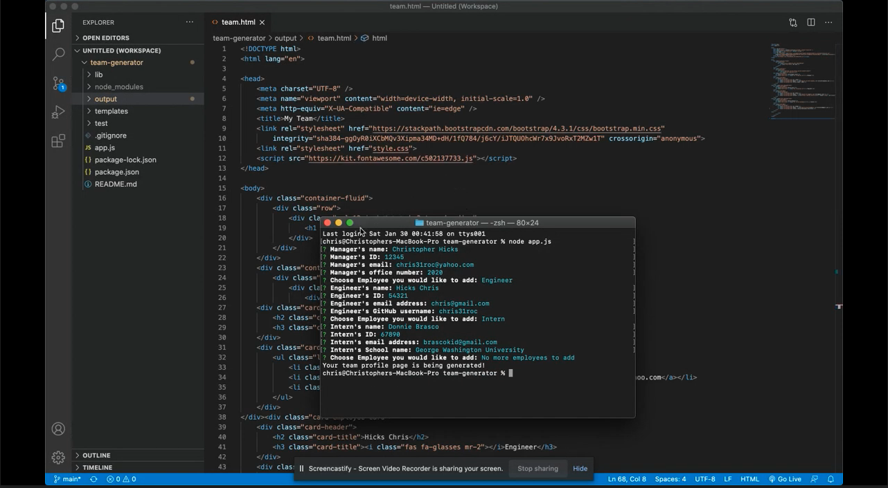
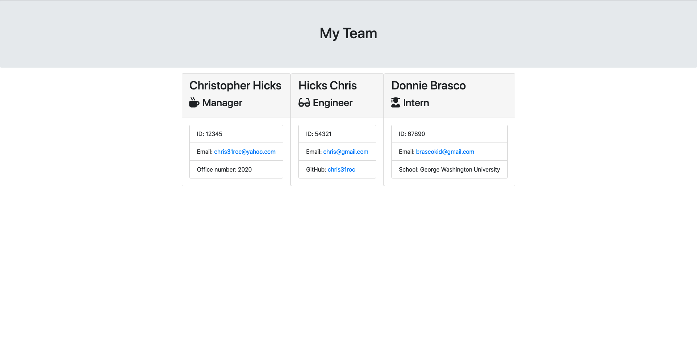

# Team Profile Generator

# Link to video
[VIEW MY WORK HERE!](https://drive.google.com/file/d/1Ktm0KICTSd6KnXdGBGz-jgVZwtTHE_8E/view)

## Table of Contents

* [Description](#Description)
* [Author](#Author)

## Description
 
  This application showcases the expansion of learning the basics of node.js by creating a README.md file, and implementing that knowledge to create a team profile generator. 
  
  Team Profile Generator is an application that generates a working team profile page from the terminal to the browser. In the terminal the application prompts the user to give information about the team manager and then information about the team members. The application will create an HTML file that displays a nicely formatted team roster based on the information provided by the user.

## Author

**Christopher Hicks**

- Github: [chris31roc](https://github.com/chris31roc)

- Email: chris31roc@yahoo.com